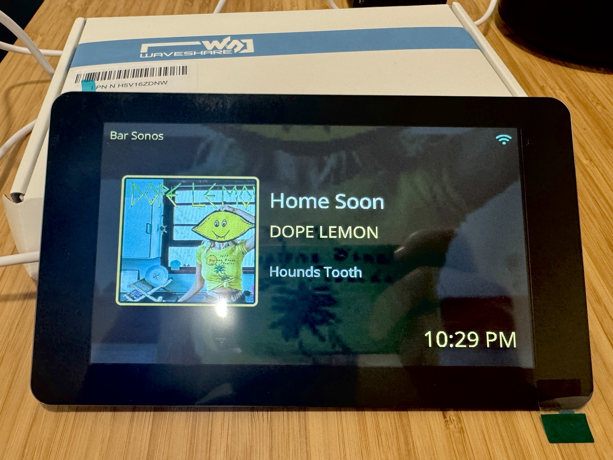

# esphome-lcd-mediaplayer-status


Homeassistant Media Player Status on waveshare-esp32-s3-touch-lcd-7 hardware.

It is entirely self-contained and will display album art, track, artist, and album information.  
There is a switch exposed to HomeAssistant that lets you configure whether the display stays on, or turns off when media isnt playing.

This code was almost entirely created using ChatGPT and many iterations to get something that actually works and looks good. 
It was initially based on the clock example from https://github.com/inytar/waveshare-esp32-s3-touch-lcd-7-esphome.

I havent been able to get this to cleanly restart after OTAs, you will need to power cycle. This may be related to the waveshare library I'm using... Not sure


## Building
You will need to manually download fonts for ESPHome to use when building. I used the `Advanced SSH & Web Terminal` addon to get shell access and copy the files in to place.

```
mkdir /config/esphome/fonts
cd /config/esphome/fonts

wget https://github.com/dchote/esphome-lcd-mediaplayer-status/raw/refs/heads/main/dependencies/Noto_Sans/NotoSans-Italic-VariableFont_wdth,wght.ttf
wget https://github.com/dchote/esphome-lcd-mediaplayer-status/raw/refs/heads/main/dependencies/Font_Awesome/fa-solid-900.ttf

cd /config/www

wget https://github.com/dchote/esphome-lcd-mediaplayer-status/raw/refs/heads/main/dependencies/placeholder.jpg
```


